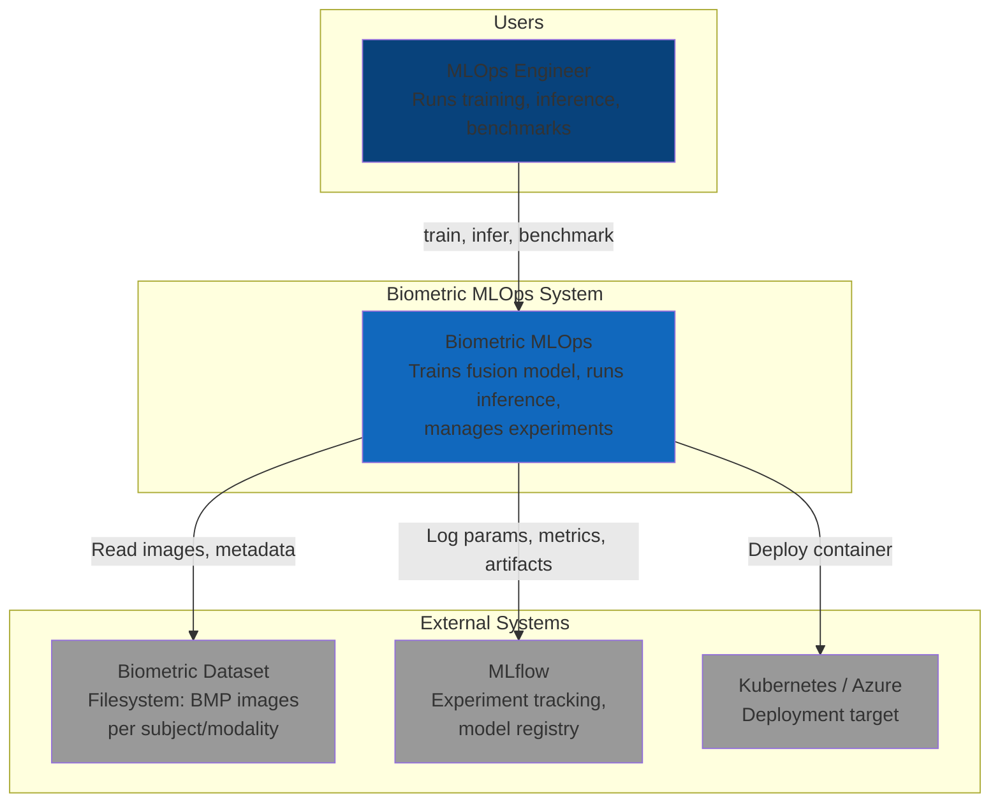
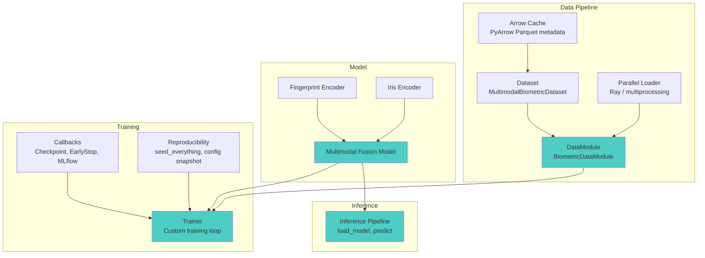
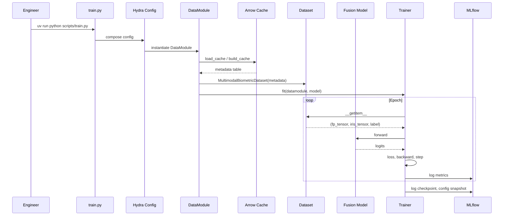
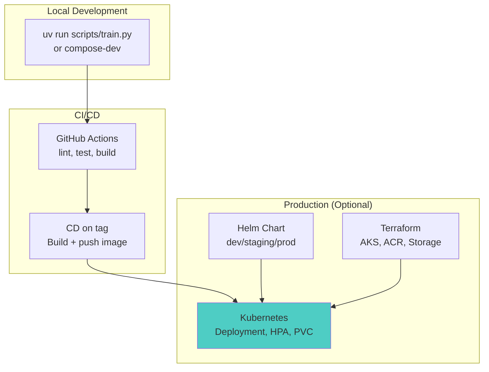

# System Architecture

[Phase 7] C4-style architecture documentation for the Multimodal Biometric Recognition MLOps infrastructure.

---

## 1. Context (C4 Level 1)

The system provides production-grade ML infrastructure for training and inference of a multimodal biometric model (iris + fingerprint fusion). An MLOps engineer interacts with it via CLI scripts; the system consumes raw image data, trains models, and produces checkpoints and predictions.

---

## 2. Containers (C4 Level 2)

The system is organized into four logical containers aligned with the `src/biometric/` package structure.

---

## 3. Components (C4 Level 3)

### 3.1 Data Layer (`src/biometric/data/`)

| Component | Responsibility |
|-----------|----------------|
| `arrow_cache` | Scans filesystem, builds Parquet metadata table, staleness detection. Enables fast dataset init without repeated glob. |
| `dataset` | `MultimodalBiometricDataset` pairs fingerprint + iris by subject; `PreloadedMultimodalDataset` for benchmarks. |
| `datamodule` | Orchestrates datasets, train/val/test splits, DataLoaders. Integrates Arrow cache and parallel preprocessing. |
| `parallel_loader` | Ray Data or multiprocessing for parallel preprocessing; config-driven via `data.use_parallel_preprocess`. |
| `preprocessing` | Per-modality transforms (resize, normalize, augment); `get_multimodal_transforms()` from config. |
| `discovery` | `discover_subjects()` — filesystem scan with sorted glob for determinism. |
| `parser` | `parse_fingerprint_filename()`, `parse_iris_path()` — extract subject_id, modality, metadata from paths. |

### 3.2 Model Layer (`src/biometric/models/`)

| Component | Responsibility |
|-----------|----------------|
| `fingerprint_encoder` | CNN branch for fingerprint images (1ch, 96×96). |
| `iris_encoder` | CNN branch for iris images (3ch, 224×224). |
| `fusion_model` | Concatenates embeddings → `nn.Linear` → logits. Port from reference Kaggle notebook (see `model_port_notes.md`). |
| `base` | Shared base classes for encoders. |

### 3.3 Training Layer (`src/biometric/training/`)

| Component | Responsibility |
|-----------|----------------|
| `trainer` | Custom training loop with AMP, gradient accumulation, `torch.compile()`. |
| `callbacks` | `CheckpointCallback`, `EarlyStoppingCallback`, `MetricLoggerCallback`, `MLflowCallback`. |
| `reproducibility` | `seed_everything()`, deterministic flags, config snapshots. |

### 3.4 Inference Layer (`src/biometric/inference/`)

| Component | Responsibility |
|-----------|----------------|
| `pipeline` | `load_model()` — load checkpoint into `MultimodalFusionModel`; `predict()` — batch inference. |

### 3.5 Scripts and Config

| Component | Responsibility |
|-----------|----------------|
| `scripts/train.py` | Hydra entry point; composes config, instantiates DataModule, model, Trainer; supports DDP via `torchrun`. |
| `scripts/infer.py` | Load checkpoint, run inference on provided images. |
| `scripts/benchmark.py` | DataLoader parameter sweep; outputs to `docs/performance_benchmarks.md`. |
| `scripts/preprocess_cache.py` | Build Arrow cache ahead of training. |
| `configs/` | Hydra configs for data, model, training, infrastructure; no hardcoded constants in `src/`. |

---

## 4. Data Flow

---

## 5. Deployment View

---

## 6. Module Boundaries

- **Data ↔ Model**: DataModule yields `(fingerprint_tensor, iris_tensor, label)`; model expects `(fp, iris)` and returns logits.
- **Model ↔ Training**: Trainer receives `nn.Module`; callbacks save/load `state_dict` via checkpoint paths.
- **Training ↔ Inference**: Shared `MultimodalFusionModel`; inference loads checkpoint with `load_model()`.
- **Config**: Hydra composes `config.yaml` + overrides; all paths and hyperparameters flow from config, not hardcoded in `src/`.

---

## References

- [C4 Model](https://c4model.com/)
- [Design Decisions](./design_decisions.md)
- [Scalability Analysis](./scalability_analysis.md)
- [Model Port Notes](./model_port_notes.md)
- [Performance Benchmarks](./performance_benchmarks.md)
- [Phase 8 Verification](./phase8_verification.md)
